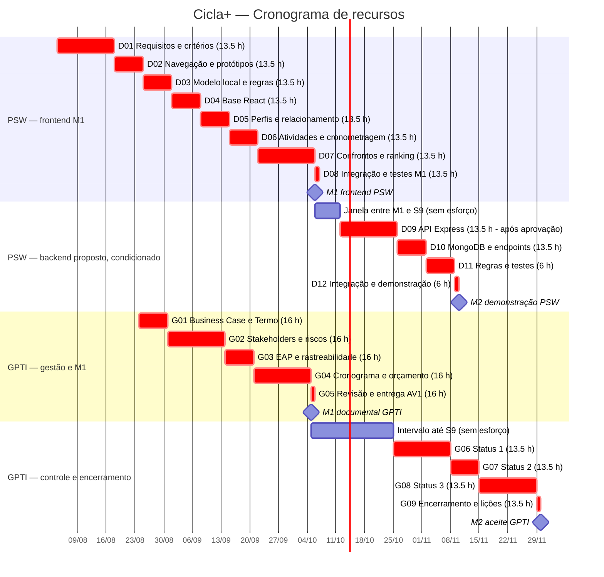

# Plano de Projeto — Cicla+ (Frontend e extensão integrada)

**Versão:** 7.0 — revisão de escopo, cronograma, recursos e custos  
**Data:** 05/10/2026  
**Patrocinador acadêmico:** Prof. Diogo Mendonça  
**Equipe:** 3 integrantes PSW (produto e desenvolvimento) e 4 integrantes GPTI (gestão e validação interna)

> Este plano organiza requisitos, EAP, cronograma, recursos, custos, riscos e engajamento do Cicla+. O marco M1 cobre o frontend demonstrável previsto no Termo de Abertura. Backend próprio e M2 são planejados como extensão proposta, ainda dependente de aprovação formal: o Termo e o Business Case vigentes excluem backend desta etapa. 
> 
> Membros:
> 
> - Gabriel Cabral (PSW)
> 
> - Hugo Lima  (PSW)
> 
> - Patrick Cruz (PSW) 
>   
>   
> 
> - Rafael Voigt (GPTI) (Coordenador do Plano)
> 
> - Rafael Yahata (GPTI)
> 
> - Daniel Dezerto (GPTI) 
> 
> - Bernardo Borio (GPTI)

**Números da linha de base proposta**

| Item                                      | Valor                                                                           | Referência |
| ----------------------------------------- | -------------------------------------------------------------------------------:| ---------- |
| Capacidade máxima dos calendários         | 162 h PSW + 144 h GPTI = 306 h                                                  | 5.3        |
| Trabalho planejado                        | 147 h PSW + 134 h GPTI = 281 h                                                  | 5.2, 6.2   |
| Contingência identificada                 | 25 h = 15 h PSW + 10 h GPTI; R$ 471,15                                          | 6.3.3      |
| Linha de base de custos, com contingência | 306 h; R$ 5.766,92                                                              | 6.4        |
| Reserva gerencial, fora da linha de base  | 7%; R$ 403,68                                                                   | 6.4        |
| Orçamento econômico simulado              | R$ 6.170,60; desembolso previsto R$ 0                                           | 6.4        |
| Marcos                                    | M1: GPTI 05/10 e frontend PSW 06/10; M2 proposto: PSW 10/11 e aceite GPTI 30/11 | 5.1        |

## 1. Objetivo da EAP

Decompor em entregas verificáveis o frontend acadêmico Cicla+ e, como extensão proposta, a integração a um backend próprio. A EAP é orientada a entregas; sua numeração representa hierarquia, não sequência de execução.

O produto de M1 é um frontend demonstrável com dados locais e perfis fictícios, cobrindo os 15 casos de uso priorizados. M2 acrescenta uma API Express e persistência MongoDB para a demonstração. M2 não autoriza operação com usuários reais, dados reais, GPS, pagamentos ou integração institucional.

**Condição de governança:** o Termo de Abertura e o Business Case atuais excluem backend e banco de dados remoto. Portanto, 1.5 e 1.6 são uma proposta de extensão para decisão da equipe de desenvolvimento e do patrocinador. Até aprovação de pedido de mudança, M1 permanece a linha de base autorizada; o cronograma e o custo de M2 são planejamento condicionado, não compromisso de execução. A condição também vale para o uso de Express/MongoDB.

## 2. EAP / WBS

### 1.0 Projeto Cicla+ — frontend demonstrável e extensão integrada proposta

- **1.1 Gestão e coordenação do projeto**
  - 1.1.1 Termo de abertura, Business Case e plano mantidos coerentes
  - 1.1.2 Backlog, decisões, riscos e mudanças acompanhados
  - 1.1.3 Demonstrações, critérios de aceite e decisões dos marcos registrados
  - 1.1.4 Cronograma, recursos, custos e engajamento controlados
- **1.2 Requisitos e desenho funcional**
  - 1.2.1 Escopo dos perfis Ciclista e Equipe consolidado
  - 1.2.2 Os 15 casos de uso, regras, permissões e critérios de aceite rastreados
  - 1.2.3 Modelo de domínio, estados e contratos de dados definidos para a demonstração
  - 1.2.4 Hipóteses, limitações e decisões de mudança documentadas
  - 1.2.5 Navegação e protótipos revisados internamente
- **1.3 Base técnica e dados de demonstração**
  - 1.3.1 Aplicação React e ambiente local preparados
  - 1.3.2 Componentes, rotas e estado do frontend organizados
  - 1.3.3 Perfis, matches, mensagens, atividades e resultados fictícios preparados
  - 1.3.4 Autenticação e alternância de perfis simuladas, sem credenciais reais
- **1.4 Marco 1 — frontend demonstrável com dados locais (M1/AV1)**
  - 1.4.1 Perfis Ciclista e Equipe, consulta e edição demonstráveis
  - 1.4.2 Sugestões, Match recíproco, Chat bloqueado/liberado e Boost demonstráveis
  - 1.4.3 Passeio, treino individual, treino em equipe e consultoria demonstráveis
  - 1.4.4 Convite, confirmação, encerramento e resultado de confronto demonstráveis
  - 1.4.5 Cronometragem, manutenção de tempo e conferência de percurso demonstráveis com dados locais e entrada simulada
  - 1.4.6 Consulta e emissão de ranking demonstráveis após resultado confirmado
  - 1.4.7 Integração de telas, verificação dos 15 casos e limitações de M1 registradas
- **1.5 Backend e regras de negócio — extensão proposta, após autorização**
  - 1.5.1 API Express inicializada, com configuração local reproduzível
  - 1.5.2 Modelo e persistência MongoDB para perfis, matches, mensagens e Boost
  - 1.5.3 Endpoints de atividades, passeios, treinos e consultoria
  - 1.5.4 Endpoints de confronto, estados de confirmação, encerramento e resultado
  - 1.5.5 Serviços de tempo e ranking com regras determinísticas e dados de demonstração
  - 1.5.6 Validações de match mútuo para Chat e de match existente para agendar treino individual
  - 1.5.7 Validação de percurso no registro de tempo por dados/entrada simulados; sem GPS real
  - 1.5.8 Testes de API, persistência e regras; tratamento de erros prioritários
- **1.6 Marco 2 — frontend integrado ao backend próprio (M2 proposto)**
  - 1.6.1 Frontend conectado aos endpoints Express prioritários
  - 1.6.2 Fluxos demonstrados com persistência MongoDB local
  - 1.6.3 Regras de Match/Chat, treino com match, percurso/tempo, confronto e ranking reproduzidas
  - 1.6.4 Testes ponta a ponta, instruções de execução e limitações documentados
  - 1.6.5 Demonstração e aceite interno de M2 registrados, se a mudança for aprovada
- **1.7 Verificação e encerramento acadêmico**
  - 1.7.1 Testes de aceitação dos fluxos priorizados executados
  - 1.7.2 Defeitos prioritários corrigidos ou registrados como limitações
  - 1.7.3 Instalação, configuração e execução documentadas
  - 1.7.4 Aceites, lições aprendidas e evolução futura registrados

Os pacotes 1.5 e 1.6 são planejados para depois de M1 e da data-limite de 05/10/2026. Nenhuma atividade de implementação ou conclusão do backend pode ocorrer até essa data, inclusive. Se a extensão for aprovada, a implementação começa em D09, na S9, em 13/10/2026. A inclusão na EAP não substitui a aprovação de mudança. A decomposição e os critérios desta seção servem como dicionário resumido dos pacotes para esta versão.

## 3. Regras de negócio do protótipo

As regras são hipóteses do protótipo acadêmico; não constituem política oficial da instituição nem compromisso de produto em produção.

1. **Dados fictícios:** perfis, mensagens, atividades, tempos e resultados são locais/fictícios. M2, se aprovado, persiste esses mesmos dados de demonstração em MongoDB local.
2. **Match e Chat:** o envio de mensagens só é habilitado após Match recíproco. O estado e o histórico são locais em M1 e persistidos pelo backend proposto em M2.
3. **Treino individual:** o agendamento com outro ciclista requer Match recíproco previamente existente.
4. **Atividades:** passeio, treino individual, treino em equipe e consultoria têm seus próprios dados e estados demonstráveis; equipe e ciclista veem fluxos compatíveis com seus perfis.
5. **Percurso e tempo:** o registro de tempo deve verificar o percurso selecionado usando dados de demonstração/entrada simulada. Cronômetro e distância não usam GPS, sensores ou serviços externos.
6. **Confrontos:** convite começa pendente; só passa a confirmado após aceite do desafiado. Encerramento e resultado exigem confirmação bilateral.
7. **Ranking:** pontuação local é recalculada depois da confirmação bilateral do resultado, segundo regra fixa documentada no protótipo. A classificação é demonstrativa, não oficial.
8. **Boost:** destaca o perfil na fila local de sugestões; não há cobrança nem pagamento real.
9. **Autenticação:** login e alternância Ciclista/Equipe são simulações, sem OAuth ou credenciais reais.

### 3.1 Limites e integrações

- Backend, banco remoto, usuários reais em dispositivos diferentes, pagamentos, comércio, GPS/sensores e integração institucional estão fora da linha de base vigente.
- Express/MongoDB são uma extensão proposta, restrita a ambiente local e dados fictícios, sujeita a mudança aprovada.
- Qualquer evolução para operação real requer nova avaliação de segurança, privacidade, infraestrutura, autorização e escopo.

## 4. Linha de base do escopo

A linha de base atualmente aprovada é o Termo de Abertura, o Business Case e o frontend M1 nele descrito. A extensão 1.5/1.6 somente passa a integrar a linha de base após decisão registrada da equipe de desenvolvimento e aprovação do patrocinador, com atualização de prazo, custo e aceite.

### 4.1 Declaração do escopo

Entregar até 06/10/2026 um frontend demonstrável dos 15 casos de uso, com dados locais e fictícios, respeitando os perfis Ciclista e Equipe. Propõe-se, condicionado a mudança formal, concluir até 30/11/2026 uma integração local Express/MongoDB, sem operação real ou integração externa.

Critério de aceite de M1: os 15 casos são executáveis; os fluxos relacionados permanecem coerentes entre telas; as regras de match, agendamento de treino, percurso, tempo e resultado podem ser verificadas com dados fictícios. Critério de M2 proposto: além dos critérios de M1, os fluxos priorizados persistem e são recuperados pela API local, com testes e instruções reproduzíveis.

### 4.2 Necessidades e soluções

| ID     | Necessidade                                     | Origem               | Solução de demonstração                              |
| ------ | ----------------------------------------------- | -------------------- | ---------------------------------------------------- |
| REQ-01 | Encontrar parceiros compatíveis                 | Business Case        | Sugestões e Match                                    |
| REQ-02 | Conversar após criar vínculo                    | Matriz de requisitos | Chat condicionado a Match recíproco                  |
| REQ-03 | Organizar atividades de ciclistas e equipes     | Termo de Abertura    | Passeios, treinos e consultoria                      |
| REQ-04 | Agendar treino individual com vínculo existente | Regra de escopo      | Verificação de Match antes de agendar                |
| REQ-05 | Registrar e conferir desempenho                 | Termo de Abertura    | Cronômetro e validação simulada de percurso          |
| REQ-06 | Consultar desempenho comparativo                | Matriz de requisitos | Ranking local derivado de resultados confirmados     |
| REQ-07 | Criar e confirmar confrontos                    | Matriz de requisitos | Convite, aceite e encerramento bilateral             |
| REQ-08 | Dar destaque a um perfil                        | Business Case        | Boost sem cobrança real                              |
| REQ-09 | Usar perfis Ciclista e Equipe                   | Termo de Abertura    | Alternância de interface e fluxos                    |
| REQ-10 | Demonstrar os fluxos sem serviços reais         | Termo de Abertura    | Dados fictícios; backend somente se mudança aprovada |

### 4.3 Matriz de rastreabilidade

| ID     | Pacotes             | Aceite observável                                                  |
| ------ | ------------------- | ------------------------------------------------------------------ |
| REQ-01 | 1.4.2               | Sugestão aceita; match recíproco aparece no estado do perfil       |
| REQ-02 | 1.4.2, 1.5.6, 1.6.3 | Chat não permite enviar antes do match mútuo                       |
| REQ-03 | 1.4.3, 1.5.3        | Os quatro tipos de atividade podem ser registrados e consultados   |
| REQ-04 | 1.4.3, 1.5.6        | Treino individual só é agendado após verificação de Match          |
| REQ-05 | 1.4.5, 1.5.5        | Tempo é registrado e percurso é verificado com entrada simulada    |
| REQ-06 | 1.4.6, 1.5.5        | Ranking reflete resultado bilateral confirmado                     |
| REQ-07 | 1.4.4, 1.5.4        | Confronto exige aceite e confirmação bilateral do resultado        |
| REQ-08 | 1.4.2               | Boost prioriza o perfil sem transação financeira                   |
| REQ-09 | 1.4.1–1.4.7         | Menus e fluxos correspondem ao perfil selecionado                  |
| REQ-10 | 1.3–1.6             | Nenhum fluxo depende de usuário real, GPS ou sistema institucional |

## 5. Processo de elaboração do cronograma

O cronograma é organizado em 12 semanas letivas, com acompanhamento em horas-pessoa. A alocação respeita o calendário do plano-modelo, as datas de M1/M2 e a restrição de que nenhuma atividade de implementação ou conclusão do backend ocorra até 05/10/2026, inclusive.

### 5.1 Calendário e regras de controle

- PSW: 3 integrantes, até 4,5 h por pessoa por semana, capacidade de 13,5 h/semana e 162 h no horizonte.
- GPTI: 4 integrantes, até 4 h por pessoa por semana, capacidade de 16 h/semana entre S4 e S12 e 144 h no horizonte do projeto.
- Semanas 1–3 de GPTI são de conteúdo da disciplina, sem esforço de projeto. Nenhuma atividade de implementação ou conclusão do backend ocorre até 05/10/2026, inclusive. O pacote técnico 1.5 tem início planejado somente em S9, após M1.
- Marcos documentais GPTI: M1/AV1 em 05/10; marco PSW/frontend em 06/10. M2 proposto: demonstração PSW em 10/11 e aceite GPTI em 30/11.
- O calendário é semanal e o realizado será registrado em horas, entrega e aceite. Alteração de linha de base exige pedido escrito, análise de impacto e aprovação.
- Limites: previsão acima de 10% do esforço do pacote, risco ao marco ou custo previsto acima da linha de base requer ação corretiva; mudança de escopo/prazo/orçamento exige decisão do patrocinador.

| Semana      | GPTI  | PSW   | Foco e restrição                                              |
| -----------:| ----- | ----- | ------------------------------------------------------------- |
| S1          | 03/08 | 04/08 | PSW: requisitos de frontend; GPTI: conceitos                  |
| S2          | 10/08 | 18/08 | PSW: navegação e protótipo; GPTI: conceitos                   |
| S3          | 17/08 | 25/08 | PSW: modelo local; GPTI: conceitos                            |
| S4          | 24/08 | 01/09 | PSW: regras do frontend; GPTI: inicia documentos              |
| S5          | 31/08 | 08/09 | Nenhuma atividade de backend até 05/10, inclusive             |
| S6          | 14/09 | 15/09 | Planejamento de M2 pode começar; sem implementação backend    |
| S7          | 21/09 | 22/09 | Frontend e linha de base M1                                   |
| S8 — M1/AV1 | 05/10 | 06/10 | Entrega documental GPTI e frontend PSW                        |
| S9          | 26/10 | 13/10 | Backend proposto começa após M1; autorização ainda necessária |
| S10         | 09/11 | 27/10 | Persistência/API e controle                                   |
| S11         | 16/11 | 03/11 | Regras, testes e integração                                   |
| S12 — M2    | 30/11 | 10/11 | Demonstração PSW e encerramento GPTI                          |

As datas de aula seguem o calendário de referência do Plano de Projeto modelo; o intervalo entre aulas não acrescenta esforço. Se aprovada, a implementação backend começa em D09, na S9, em 13/10/2026, depois do limite de 05/10 e de M1. O planejamento e a decisão da extensão podem ocorrer antes; não haverá implementação ou conclusão de atividade backend até 05/10/2026, inclusive.

### 5.2 Atividades, precedências e esforço

**Atividades de produto — PSW**

| ID               | Saída verificável                                             | Predecessora             | Janela | Esforço   | Responsável                              |
| ---------------- | ------------------------------------------------------------- | ------------------------ | ------:| ---------:| ---------------------------------------- |
| D01              | Requisitos de frontend, 15 casos e critérios de aceite        | —                        | S1     | 13,5 h    | Gabriel Cabral, Hugo Lima e Patrick Cruz |
| D02              | Navegação e protótipos das telas                              | D01 FS                   | S2     | 13,5 h    | Gabriel Cabral, Hugo Lima e Patrick Cruz |
| D03              | Modelo local, estados e regras do protótipo                   | D01–D02 FS               | S3     | 13,5 h    | Gabriel Cabral, Hugo Lima e Patrick Cruz |
| D04              | Estrutura React, rotas e componentes base                     | D02–D03 FS               | S4     | 13,5 h    | Gabriel Cabral, Hugo Lima e Patrick Cruz |
| D05              | Perfis, alternância Ciclista/Equipe e relacionamento          | D04 SS                   | S5     | 13,5 h    | Gabriel Cabral, Hugo Lima e Patrick Cruz |
| D06              | Atividades, match para treino e cronômetro/tempo              | D04 SS                   | S6     | 13,5 h    | Gabriel Cabral, Hugo Lima e Patrick Cruz |
| D07              | Confrontos, resultados, ranking e Boost                       | D05–D06 SS               | S7     | 13,5 h    | Gabriel Cabral, Hugo Lima e Patrick Cruz |
| D08              | Integração de telas, testes dos 15 casos e demonstração M1    | D05–D07 FS/SS            | S8     | 13,5 h    | Gabriel Cabral, Hugo Lima e Patrick Cruz |
| **M1**           | **Frontend demonstrável entregue**                            | D08 FS                   | S8     | **0 h**   | PSW/GPTI; patrocinador ciente            |
| D09              | Após autorização: API Express e ambiente local reproduzível   | M1 e mudança aprovada FS | S9     | 13,5 h    | Gabriel Cabral, Hugo Lima e Patrick Cruz |
| D10              | Persistência MongoDB e endpoints prioritários de domínio      | D09 FS                   | S10    | 13,5 h    | Gabriel Cabral, Hugo Lima e Patrick Cruz |
| D11              | Regras de Match, treino, percurso/tempo e confronto/resultado | D10 FS                   | S11    | 6 h       | Gabriel Cabral, Hugo Lima e Patrick Cruz |
| D12              | Integração frontend/API, testes, instruções e demonstração M2 | D11 FS                   | S12    | 6 h       | Gabriel Cabral, Hugo Lima e Patrick Cruz |
| **M2**           | **Integração local demonstrada, se autorizada**               | D12 FS                   | S12    | **0 h**   | Equipes; patrocinador aprova             |
| **Subtotal PSW** |                                                               |                          | S1–S12 | **147 h** |                                          |

**Atividades de gestão — GPTI**

| ID                | Saída verificável                                          | Predecessora | Janela | Esforço   | Responsável                                                  |
| ----------------- | ---------------------------------------------------------- | ------------ | ------:| ---------:| ------------------------------------------------------------ |
| G01               | Consolidar Business Case e Termo de Abertura               | —            | S4     | 16 h      | Rafael Voigt, Daniel Dezerto                                 |
| G02               | Stakeholders, governança e riscos iniciais                 | G01 SS       | S5     | 16 h      | Rafael Yahata, Bernardo Borio                                |
| G03               | EAP, requisitos, critérios de aceite e rastreabilidade     | G01 FS       | S6     | 16 h      | Rafael Voigt, Rafael Yahata                                  |
| G04               | Atividades, precedências, recursos, cronograma e orçamento | G03 FS       | S7     | 16 h      | Rafael Voigt, Rafael Yahata, Daniel Dezerto e Bernardo Borio |
| G05               | Integrar/revisar documentos e entregar artefatos da AV1    | G04 FS       | S8     | 16 h      | Rafael Voigt, Rafael Yahata, Daniel Dezerto e Bernardo Borio |
| G06               | Status Report 1: escopo, prazo, M2 condicionado e riscos   | G05 FS       | S9     | 13,5 h    | Rafael Voigt, Rafael Yahata, Daniel Dezerto e Bernardo Borio |
| G07               | Status Report 2: recursos, custos e qualidade              | G06 FS       | S10    | 13,5 h    | Rafael Voigt, Rafael Yahata, Daniel Dezerto e Bernardo Borio |
| G08               | Status Report 3: engajamento, pendências e decisões        | G07 FS       | S11    | 13,5 h    | Rafael Voigt, Rafael Yahata, Daniel Dezerto e Bernardo Borio |
| G09               | Encerramento, aceite, lições e arquivo do projeto          | G08/D12 SS   | S12    | 13,5 h    | Rafael Voigt, Rafael Yahata, Daniel Dezerto e Bernardo Borio |
| **Subtotal GPTI** |                                                            |              | S4–S12 | **134 h** |                                                              |

FS = término–início; SS = início–início. D09–D12 não podem começar sem aprovação formal da extensão. O esforço do M2 é uma estimativa preliminar para demonstração local, não para produção.

### 5.3 Recursos e capacidade

| Grupo     | Pessoas | Capacidade individual | Capacidade total | Trabalho planejado | Reserva de contingência | Utilização da capacidade              |
| --------- | -------:| ---------------------:| ----------------:| ------------------:| -----------------------:| -------------------------------------:|
| PSW       | 3       | 4,5 h/semana          | 162 h            | 147 h              | 15 h                    | 100% se contingência ocorrer          |
| GPTI      | 4       | 4 h/semana em S4–S12  | 144 h            | 134 h              | 10 h                    | 100% se contingência ocorrer          |
| **Total** | **7**   |                       | **306 h**        | **281 h**          | **25 h**                | **100% se toda contingência ocorrer** |

As 25 h de contingência estão dentro da capacidade máxima e não são trabalho agendado. Sem evento, permanecem livres. Se forem acionadas, a equipe deve substituir tarefas de menor prioridade dentro da capacidade; não se presume hora extra. A extensão M2 somente cabe nesta linha mediante aprovação e manutenção das estimativas acima.

### 5.4 Gantt de recursos do projeto

Os gráficos seguem a estrutura dos Gantts de referência: o primeiro apresenta tarefas, semanas letivas, datas de GPTI/PSW, responsáveis, esforço e dependências destacáveis. O M2 e suas barras aparecem como condicionais à aprovação formal da extensão.

#### Gantt de recursos e dependências

#### Gantt de alocação individual

Cada barra identifica semana, atividade e horas alocadas à pessoa. S1–S12 usam as datas de aula indicadas na seção 5.1; D09–D12 aparecem somente após M1 e dependem da aprovação da extensão.

```mermaid
gantt
    title Cicla+ — Alocação semanal individual
    dateFormat YYYY-MM-DD
    axisFormat %d/%m

    section Gabriel Cabral — frontend e API
    S1 D01 Requisitos (4.5 h) :p1s1, 2026-08-04, 1d
    S2 D02 Navegação (4.5 h) :p1s2, 2026-08-18, 1d
    S3 D03 Modelo (4.5 h) :p1s3, 2026-08-25, 1d
    S4 D04 Base React (4.5 h) :p1s4, 2026-09-01, 1d
    S5 D05 Perfis (4.5 h) :p1s5, 2026-09-08, 1d
    S6 D06 Atividades (4.5 h) :p1s6, 2026-09-15, 1d
    S7 D07 Confrontos (4.5 h) :p1s7, 2026-09-22, 1d
    S8 D08 Integração M1 (4.5 h) :p1s8, 2026-10-06, 1d
    S9 D09 API Express condicional (4.5 h) :p1s9, 2026-10-13, 1d
    S10 D10 Persistência (4.5 h) :p1s10, 2026-10-27, 1d
    S11 D11 Regras (2 h) :p1s11, 2026-11-03, 1d
    S12 D12 Integração M2 (2 h) :p1s12, 2026-11-10, 1d

    section Hugo Lima — relacionamento e serviços
    S1 D01 Casos de uso (4.5 h) :p2s1, 2026-08-04, 1d
    S2 D02 Protótipos (4.5 h) :p2s2, 2026-08-18, 1d
    S3 D03 Estados (4.5 h) :p2s3, 2026-08-25, 1d
    S4 D04 Componentes (4.5 h) :p2s4, 2026-09-01, 1d
    S5 D05 Match e Chat (4.5 h) :p2s5, 2026-09-08, 1d
    S6 D06 Treino e Match (4.5 h) :p2s6, 2026-09-15, 1d
    S7 D07 Resultado e ranking (4.5 h) :p2s7, 2026-09-22, 1d
    S8 D08 Testes M1 (4.5 h) :p2s8, 2026-10-06, 1d
    S9 D09 Ambiente local condicional (4.5 h) :p2s9, 2026-10-13, 1d
    S10 D10 Endpoints (4.5 h) :p2s10, 2026-10-27, 1d
    S11 D11 Validações (2 h) :p2s11, 2026-11-03, 1d
    S12 D12 Testes e documentação (2 h) :p2s12, 2026-11-10, 1d

    section Patrick Cruz — atividades e desempenho
    S1 D01 Critérios de aceite (4.5 h) :p3s1, 2026-08-04, 1d
    S2 D02 Telas (4.5 h) :p3s2, 2026-08-18, 1d
    S3 D03 Regras locais (4.5 h) :p3s3, 2026-08-25, 1d
    S4 D04 Rotas (4.5 h) :p3s4, 2026-09-01, 1d
    S5 D05 Boost e perfil Equipe (4.5 h) :p3s5, 2026-09-08, 1d
    S6 D06 Tempo e percurso (4.5 h) :p3s6, 2026-09-15, 1d
    S7 D07 Ranking e Boost (4.5 h) :p3s7, 2026-09-22, 1d
    S8 D08 Demonstração M1 (4.5 h) :p3s8, 2026-10-06, 1d
    S9 D09 Contratos API condicional (4.5 h) :p3s9, 2026-10-13, 1d
    S10 D10 Testes de persistência (4.5 h) :p3s10, 2026-10-27, 1d
    S11 D11 Testes de regras (2 h) :p3s11, 2026-11-03, 1d
    S12 D12 Demonstração M2 (2 h) :p3s12, 2026-11-10, 1d

    section Rafael Voigt — escopo e desempenho
    S4 G01 Business Case (4 h) :g1s4, 2026-08-24, 1d
    S5 G02 Riscos (4 h) :g1s5, 2026-08-31, 1d
    S6 G03 Escopo (4 h) :g1s6, 2026-09-14, 1d
    S7 G04 Atividades (4 h) :g1s7, 2026-09-21, 1d
    S8 G05 Revisão do Termo (4 h) :g1s8, 2026-10-05, 1d
    S9 G06 Escopo (3.5 h) :g1s9, 2026-10-26, 1d
    S10 G07 Custos (3.5 h) :g1s10, 2026-11-09, 1d
    S11 G08 Stakeholders (3.5 h) :g1s11, 2026-11-16, 1d
    S12 G09 Aceite (3.5 h) :g1s12, 2026-11-30, 1d

    section Rafael Yahata — tempo e riscos
    S4 G01 Termo de Abertura (4 h) :g2s4, 2026-08-24, 1d
    S5 G02 Governança (4 h) :g2s5, 2026-08-31, 1d
    S6 G03 Casos de uso (4 h) :g2s6, 2026-09-14, 1d
    S7 G04 Rede e caminho crítico (4 h) :g2s7, 2026-09-21, 1d
    S8 G05 Revisão do Plano (4 h) :g2s8, 2026-10-05, 1d
    S9 G06 Cronograma (3.5 h) :g2s9, 2026-10-26, 1d
    S10 G07 Recursos (3.5 h) :g2s10, 2026-11-09, 1d
    S11 G08 Pendências (3.5 h) :g2s11, 2026-11-16, 1d
    S12 G09 Lições aprendidas (3.5 h) :g2s12, 2026-11-30, 1d

    section Daniel Dezerto — requisitos e controle
    S4 G01 Revisão documental (4 h) :g3s4, 2026-08-24, 1d
    S5 G02 Stakeholders (4 h) :g3s5, 2026-08-31, 1d
    S6 G03 Matriz (4 h) :g3s6, 2026-09-14, 1d
    S7 G04 Esforço e custos (4 h) :g3s7, 2026-09-21, 1d
    S8 G05 Revisão do Business Case (4 h) :g3s8, 2026-10-05, 1d
    S9 G06 Riscos (3.5 h) :g3s9, 2026-10-26, 1d
    S10 G07 Qualidade (3.5 h) :g3s10, 2026-11-09, 1d
    S11 G08 Mudanças (3.5 h) :g3s11, 2026-11-16, 1d
    S12 G09 Encerramento (3.5 h) :g3s12, 2026-11-30, 1d

    section Bernardo Borio — integração e comunicação
    S4 G01 Consistência (4 h) :g4s4, 2026-08-24, 1d
    S5 G02 Registro (4 h) :g4s5, 2026-08-31, 1d
    S6 G03 Critérios de aceite (4 h) :g4s6, 2026-09-14, 1d
    S7 G04 Recursos (4 h) :g4s7, 2026-09-21, 1d
    S8 G05 Entrega AV1 (4 h) :g4s8, 2026-10-05, 1d
    S9 G06 Status 1 (3 h) :g4s9, 2026-10-26, 1d
    S10 G07 Status 2 (3 h) :g4s10, 2026-11-09, 1d
    S11 G08 Status 3 (3 h) :g4s11, 2026-11-16, 1d
    S12 G09 Arquivo (3 h) :g4s12, 2026-11-30, 1d
```

O caminho crítico técnico de M1 é D01 → D02 → D03 → D04 → D05 → D06 → D07 → D08 → M1; o caminho de M2, se aprovado, é D09 → D10 → D11 → D12 → M2. A cadeia de gestão é G01 → G02 → G03 → G04 → G05 até M1, seguida por G06 → G07 → G08 → G09 até o encerramento proposto. O gráfico individual também mostra a sequência de tarefas por integrante; suas horas correspondem às tabelas das seções 5.5 e 5.6.

### 5.5 Alocação semanal individual — PSW

Cada aluno tem capacidade máxima de 4,5 h/semana. Uma atividade de 13,5 h é distribuída em 4,5 h para cada integrante. Em S11 e S12, a diferença até a capacidade fica reservada para contingência, não para escopo adicional. O gráfico individual detalha cada atribuição em uma célula por pessoa/semana e em barras proporcionais às horas.

| Semana    | Gabriel Cabral           | Hugo Lima                     | Patrick Cruz                    | Total planejado |
| ---------:| ------------------------ | ----------------------------- | ------------------------------- | ---------------:|
| S1        | D01 — requisitos 4,5 h   | D01 — casos 4,5 h             | D01 — aceite 4,5 h              | 13,5 h          |
| S2        | D02 — navegação 4,5 h    | D02 — telas 4,5 h             | D02 — protótipo 4,5 h           | 13,5 h          |
| S3        | D03 — modelo 4,5 h       | D03 — estados 4,5 h           | D03 — regras 4,5 h              | 13,5 h          |
| S4        | D04 — base React 4,5 h   | D04 — componentes 4,5 h       | D04 — rotas 4,5 h               | 13,5 h          |
| S5        | D05 — perfil 4,5 h       | D05 — Match/Chat 4,5 h        | D05 — Boost/perfil equipe 4,5 h | 13,5 h          |
| S6        | D06 — atividades 4,5 h   | D06 — treino/match 4,5 h      | D06 — tempo/percurso 4,5 h      | 13,5 h          |
| S7        | D07 — confronto 4,5 h    | D07 — resultado/ranking 4,5 h | D07 — Boost/fluxos 4,5 h        | 13,5 h          |
| S8 — M1   | D08 — integração 4,5 h   | D08 — testes 4,5 h            | D08 — demonstração 4,5 h        | 13,5 h          |
| S9        | D09 — API 4,5 h          | D09 — ambiente 4,5 h          | D09 — contratos 4,5 h           | 13,5 h          |
| S10       | D10 — persistência 4,5 h | D10 — endpoints 4,5 h         | D10 — testes 4,5 h              | 13,5 h          |
| S11       | D11 — regras 2 h         | D11 — validações 2 h          | D11 — testes 2 h                | 6 h             |
| S12 — M2  | D12 — integração 2 h     | D12 — documentação 2 h        | D12 — demonstração 2 h          | 6 h             |
| **Total** | **49 h**                 | **49 h**                      | **49 h**                        | **147 h**       |

### 5.6 Alocação semanal individual — GPTI

Nas semanas 1–3 há aula de conceitos, sem esforço de projeto. A capacidade semanal nas semanas de projeto é de até 4 h por pessoa. O saldo não utilizado em S9–S12 compõe a reserva de 10 h de GPTI. A visão individual no Gantt distingue horas de projeto e semanas sem alocação.

| Semana                   | Rafael Voigt             | Rafael Yahata           | Daniel Dezerto           | Bernardo Borio         | Total planejado |
| ------------------------:| ------------------------ | ----------------------- | ------------------------ | ---------------------- | ---------------:|
| S1–S3                    | Conceitos; 0 h           | Conceitos; 0 h          | Conceitos; 0 h           | Conceitos; 0 h         | 0 h             |
| S4                       | G01 — Business Case 4 h  | G01 — Termo 4 h         | G01 — revisão 4 h        | G01 — consistência 4 h | 16 h            |
| S5                       | G02 — riscos 4 h         | G02 — governança 4 h    | G02 — stakeholders 4 h   | G02 — registro 4 h     | 16 h            |
| S6                       | G03 — escopo 4 h         | G03 — casos 4 h         | G03 — matriz 4 h         | G03 — aceite 4 h       | 16 h            |
| S7                       | G04 — atividades 4 h     | G04 — rede 4 h          | G04 — esforço/custo 4 h  | G04 — recursos 4 h     | 16 h            |
| S8 — M1                  | G05 — revisão Termo 4 h  | G05 — revisão Plano 4 h | G05 — Business Case 4 h  | G05 — entrega AV1 4 h  | 16 h            |
| S9                       | G06 — escopo 3,5 h       | G06 — cronograma 3,5 h  | G06 — risco 3,5 h        | G06 — Status 1 3 h     | 13,5 h          |
| S10                      | G07 — custo 3,5 h        | G07 — recursos 3,5 h    | G07 — qualidade 3,5 h    | G07 — Status 2 3 h     | 13,5 h          |
| S11                      | G08 — stakeholders 3,5 h | G08 — pendências 3,5 h  | G08 — mudança 3,5 h      | G08 — Status 3 3 h     | 13,5 h          |
| S12 — M2                 | G09 — aceite 3,5 h       | G09 — lições 3,5 h      | G09 — encerramento 3,5 h | G09 — arquivo 3 h      | 13,5 h          |
| **Total por integrante** | **34 h**                 | **34 h**                | **34 h**                 | **32 h**               | **134 h**       |

### 5.7 Responsabilidades e fazer ou comprar

| Pacote                       | Responsável por prestar contas (A) | Execução (R)                                                   |
| ---------------------------- | ---------------------------------- | -------------------------------------------------------------- |
| 1.1 Gestão                   | Rafael Voigt                       | Rafael Voigt, Rafael Yahata, Daniel Dezerto e Bernardo Borio   |
| 1.2 Requisitos e desenho     | Rafael Yahata                      | PSW propõe; GPTI valida                                        |
| 1.3 Base técnica             | Gabriel Cabral                     | Gabriel Cabral, Hugo Lima e Patrick Cruz                       |
| 1.4 Frontend M1              | Hugo Lima                          | Gabriel Cabral, Hugo Lima e Patrick Cruz                       |
| 1.5 Backend proposto         | Patrick Cruz, após autorização     | Gabriel Cabral, Hugo Lima e Patrick Cruz                       |
| 1.6 Integração M2 proposta   | Gabriel Cabral, após autorização   | Gabriel Cabral, Hugo Lima e Patrick Cruz; GPTI registra aceite |
| 1.7 Verificação/encerramento | Bernardo Borio                     | GPTI registra; PSW demonstra                                   |

O protótipo será produzido pela equipe. Não se prevê compra de solução, pagamento, hospedagem, domínio ou integração institucional. A escolha de ferramentas locais para M2 depende da aprovação da extensão e não cria aquisição financeira.

## 6. Orçamento por composição

### 6.1 Premissas

- O custo é econômico simulado, não remuneração nem desembolso. Desembolso financeiro planejado: R$ 0,00, condicionado à disponibilidade dos recursos existentes.
- Taxa-sombra uniforme: R$ 18,8461538 por hora-pessoa, somente para comparação didática.
- Esforço planejado: 147 h PSW + 134 h GPTI = 281 h. A contingência de 25 h está dentro da capacidade máxima dos calendários.
- Reserva gerencial de 7% é financeira e não autoriza escopo ou horas adicionais. Infraestrutura paga, dispositivos e operação estão excluídos.

### 6.2 Distribuição semanal da linha de base

| Semana    | PSW       | GPTI      | Total planejado | Custo simulado  | Saída principal                      |
| ---------:| ---------:| ---------:| ---------------:| ---------------:| ------------------------------------ |
| S1        | 13,5 h    | 0 h       | 13,5 h          | R$ 254,42       | Requisitos                           |
| S2        | 13,5 h    | 0 h       | 13,5 h          | R$ 254,42       | Protótipos                           |
| S3        | 13,5 h    | 0 h       | 13,5 h          | R$ 254,42       | Modelo local                         |
| S4        | 13,5 h    | 16 h      | 29,5 h          | R$ 555,96       | Frontend; iniciação GPTI             |
| S5        | 13,5 h    | 16 h      | 29,5 h          | R$ 555,96       | Frontend; stakeholders               |
| S6        | 13,5 h    | 16 h      | 29,5 h          | R$ 555,96       | Frontend; EAP e requisitos           |
| S7        | 13,5 h    | 16 h      | 29,5 h          | R$ 555,96       | Frontend; cronograma/custos          |
| S8 — M1   | 13,5 h    | 16 h      | 29,5 h          | R$ 555,96       | Frontend e documentos AV1            |
| S9        | 13,5 h    | 13,5 h    | 27 h            | R$ 508,85       | M2 proposto; Status 1                |
| S10       | 13,5 h    | 13,5 h    | 27 h            | R$ 508,85       | Persistência; Status 2               |
| S11       | 6 h       | 13,5 h    | 19,5 h          | R$ 367,50       | Regras/testes; Status 3              |
| S12 — M2  | 6 h       | 13,5 h    | 19,5 h          | R$ 367,50       | Integração/demonstração/encerramento |
| **Total** | **147 h** | **134 h** | **281 h**       | **R$ 5.295,77** |                                      |

### 6.3 Análise de riscos e contingência

#### 6.3.1 Escalas

- Probabilidade baixa: até 25%; média: 26%–50%; alta: acima de 50%.
- Impacto baixo: até 8 h; médio: 9–16 h; alto: 17 h ou mais.
- Prioridade alta: alta probabilidade com impacto médio/alto ou probabilidade média com impacto alto.
- Exposição = probabilidade × impacto em horas. A escala é estimativa inicial e deve ser revisada nos relatórios de status.

#### 6.3.2 Registro e resposta

| ID   | Risco/impacto                                                | Prob. | Impacto | Prioridade | Prevenção e gatilho/resposta                                                                                                                               | Responsável    |
| ---- | ------------------------------------------------------------ | -----:| -------:| ---------- | ---------------------------------------------------------------------------------------------------------------------------------------------------------- | -------------- |
| RT01 | Fluxos do frontend não integram no M1                        | 40%   | 15 h    | Média      | Contratos de estado na S3; gatilho: falha de fluxo na integração S7/S8; priorizar os 15 aceites essenciais                                                 | Hugo Lima      |
| RT02 | Regras de Match, treino, confronto ou ranking inconsistentes | 35%   | 16 h    | Média      | Casos determinísticos antes dos testes; gatilho: qualquer resultado divergente; corrigir regra prioritária e retestar                                      | Patrick Cruz   |
| RT03 | A extensão backend não é aprovada ou ultrapassa a capacidade | 35%   | 20 h    | Alta       | Decidir mudança até M1; gatilho: ausência de aprovação ou previsão acima de 39 h após M1; manter M1 e cancelar/postergar M2                                | Rafael Voigt   |
| RT04 | Persistência/ambiente MongoDB impede demonstração            | 25%   | 12 h    | Baixa      | Configuração e seed reproduzíveis; gatilho: outro integrante não consegue subir o ambiente; usar demonstração local sem persistência e registrar limitação | Gabriel Cabral |
| RG01 | Requisitos ou aceite mudam perto do marco                    | 30%   | 12 h    | Média      | Congelar escopo M1; gatilho: solicitação fora da EAP; controle de mudança com impacto em prazo/custo                                                       | Rafael Yahata  |
| RG02 | Indisponibilidade de integrante compromete entrega           | 25%   | 16 h    | Baixa      | Revisão cruzada e registro de decisões; gatilho: carga abaixo do previsto por duas semanas; redistribuir dentro da capacidade e priorizar essencial        | Rafael Voigt   |
| RG03 | Documento acadêmico exige retrabalho                         | 20%   | 10 h    | Baixa      | Checklist e revisão cruzada antes da AV1; gatilho: item obrigatório reprovado; corrigir requisito antes de melhoria editorial                              | Bernardo Borio |
| RG04 | Expectativa de uso institucional/real excede o protótipo     | 20%   | 12 h    | Baixa      | Informar dados fictícios e ausência de autorização; gatilho: pedido de acesso/implantação; escalar ao patrocinador e não assumir compromisso               | Daniel Dezerto |

Mitigações ordinárias fazem parte das horas planejadas. Contingência só é consumida após gatilho registrado; trabalho de backend permanece bloqueado até aprovação formal da mudança.

#### 6.3.3 Exposição e reserva nomeada

| ID                  | Probabilidade | Impacto | Exposição  |
| ------------------- | -------------:| -------:| ----------:|
| RT01                | 40%           | 15 h    | 6,0 h      |
| RT02                | 35%           | 16 h    | 5,6 h      |
| RT03                | 35%           | 20 h    | 7,0 h      |
| RT04                | 25%           | 12 h    | 3,0 h      |
| RG01                | 30%           | 12 h    | 3,6 h      |
| RG02                | 25%           | 16 h    | 4,0 h      |
| RG03                | 20%           | 10 h    | 2,0 h      |
| RG04                | 20%           | 12 h    | 2,4 h      |
| **Exposição total** |               |         | **33,6 h** |

A exposição excede a reserva disponível; não é uma promessa de cobertura integral do pior caso. A reserva de contingência é limitada a 25 h pela capacidade informada e tem alocação máxima por equipe:

| Evento                                   | Reserva                         | Quem executa                           |
| ---------------------------------------- | -------------------------------:| -------------------------------------- |
| RT01 — integração frontend               | 5 h PSW                         | PSW                                    |
| RT02 — regra de negócio divergente       | 5 h PSW                         | PSW                                    |
| RT03 — replanejamento/cancelamento de M2 | 3 h GPTI + 2 h PSW              | GPTI registra; PSW ajusta demonstração |
| RT04 — ambiente de persistência          | 3 h PSW                         | PSW                                    |
| RG01 — mudança de requisito              | 2 h GPTI                        | GPTI                                   |
| RG02 — redistribuição de esforço         | 2 h GPTI                        | GPTI                                   |
| RG03 — retrabalho documental             | 2 h GPTI                        | GPTI                                   |
| RG04 — expectativa externa               | 1 h GPTI                        | GPTI                                   |
| **Total**                                | **15 h PSW + 10 h GPTI = 25 h** |                                        |

Se um evento exigir esforço além da reserva, a equipe reduz item não essencial, replaneja o marco ou solicita mudança aprovada. Não se presume hora extra. A reserva gerencial não pode ser usada sem aprovação do patrocinador.

### 6.4 Linha de base de custos e orçamento

| Componente                       | Cálculo                           | Valor simulado  |
| -------------------------------- | --------------------------------- | ---------------:|
| Trabalho planejado PSW           | 147 h × R$ 18,8461538/h           | R$ 2.770,38     |
| Trabalho planejado GPTI          | 134 h × R$ 18,8461538/h           | R$ 2.525,38     |
| **Trabalho planejado**           | **281 h**                         | **R$ 5.295,77** |
| Contingência identificada        | 25 h × R$ 18,8461538/h            | R$ 471,15       |
| **Linha de base de custos**      | **306 h**                         | **R$ 5.766,92** |
| Reserva gerencial                | 7% × R$ 5.766,92                  | R$ 403,68       |
| **Orçamento econômico simulado** | Linha de base + reserva gerencial | **R$ 6.170,60** |

O desembolso previsto é R$ 0,00, sujeito à confirmação de uso exclusivo de recursos disponíveis. Os cálculos usam taxa não arredondada; diferenças de R$ 0,01 podem ocorrer nas somas visuais. A reserva de contingência está dentro da linha de base; a reserva gerencial está fora.

## 7. Plano de engajamento das partes interessadas

### 7.1 Premissas e níveis

Considera-se situação inicial neutra até validação. C = corrente; D = desejada. O engajamento externo não implica aprovação de regras, integração ou implantação.

| Stakeholder                                  | Desinformado | Resistente | Neutro | Apoiador | Líder |
| -------------------------------------------- |:------------:|:----------:|:------:|:--------:|:-----:|
| Prof. Diogo Mendonça — patrocinador          |              |            | C      |          | D     |
| Equipe GPTI                                  |              |            | C      |          | D     |
| Equipe PSW                                   |              |            | C      |          | D     |
| Ciclistas/equipes como público de referência |              |            | C      | D        |       |
| Instituição                                  |              |            | C/D    |          |       |

### 7.2 Poder, interesse e estratégia

| Parte             | Poder                                                        | Interesse         | Impacto                              | Estratégia                                          |
| ----------------- | ------------------------------------------------------------ | ----------------- | ------------------------------------ | --------------------------------------------------- |
| Patrocinador      | Alto: marcos, mudanças e cancelamento                        | Alto              | Avalia entrega acadêmica             | Gerenciar de perto                                  |
| GPTI              | Médio: planejamento e controle                               | Alto              | Documentos, riscos e aceite interno  | Gerenciar de perto                                  |
| PSW               | Médio: produto e decisões técnicas                           | Alto              | Frontend e eventual extensão backend | Gerenciar de perto                                  |
| Ciclistas/equipes | Baixo: não aprovam formalmente                               | Alto              | Público de referência                | Manter informado, se houver demonstração autorizada |
| Instituição       | Alto para uso real futuro; sem poder operacional nesta etapa | Baixo nesta etapa | Nenhum trabalho previsto             | Sem contato/compromisso sem autorização             |

### 7.3 Plano breve de engajamento

| Stakeholder                  | Objetivo                                                                     | Ações, canal e frequência                                                                                   | Responsável                                                                      | Evidência/indicador                                                                      |
| ---------------------------- | ---------------------------------------------------------------------------- | ----------------------------------------------------------------------------------------------------------- | -------------------------------------------------------------------------------- | ---------------------------------------------------------------------------------------- |
| Patrocinador                 | Obter decisões tempestivas sobre marcos e eventual mudança M2                | Síntese quinzenal; demonstrações em M1/M2; pedido escrito quando houver decisão de escopo, prazo ou reserva | Rafael Voigt                                                                     | Decisões registradas; ciência de M1; aprovação explícita antes de iniciar 1.5/1.6        |
| Equipe GPTI                  | Manter plano, riscos, custos e documentação coerentes                        | Reunião semanal; revisão cruzada; atualização de status, cronograma e mudanças                              | Rafael Voigt coordena; Rafael Yahata, Daniel Dezerto e Bernardo Borio participam | Artefatos consistentes; três status reports; decisões e riscos atualizados               |
| Equipe PSW                   | Manter execução técnica verificável e aderente aos limites                   | Planejamento semanal; demonstrações curtas; revisão entre pares; impedimentos registrados                   | Gabriel Cabral coordena; Hugo Lima/3 participam                                  | Horas e entregas por ID; aceite dos 15 casos; nenhum backend iniciado antes da aprovação |
| Ciclistas e equipes amadoras | Verificar compreensão da demonstração, sem sugerir validação de produto real | Demonstração com dados fictícios, uma vez em M1 ou M2, se autorizada; coletar percepções sem ampliar escopo | Rafael Yahata e Patrick Cruz                                                     | Feedback registrado como hipótese/backlog; aviso de que não é serviço oficial            |
| Instituição                  | Evitar compromisso de implantação e preservar limites de dados               | Sem contato operacional nesta etapa; eventual comunicação somente por autorização do patrocinador           | Patrocinador                                                                     | Nenhuma credencial, dado real ou integração solicitada; limitações registradas           |

### 7.4 Cadência de comunicação

| Público                         | Conteúdo                                        | Canal                                   | Ritmo                        | Responsável                   |
| ------------------------------- | ----------------------------------------------- | --------------------------------------- | ---------------------------- | ----------------------------- |
| Patrocinador                    | Marco, riscos, decisões e mudança proposta      | Reunião/demonstração e registro escrito | Quinzenal; também em M1 e M2 | Rafael Voigt                  |
| GPTI e PSW                      | Tarefas, impedimentos, horas e aceite           | Quadro, repositório e reunião conjunta  | Semanal                      | Rafael Voigt e Gabriel Cabral |
| Público ciclista, se autorizado | Capacidades e limites do protótipo              | Demonstração com dados fictícios        | Uma vez em M1 ou M2          | Rafael Yahata                 |
| Instituição                     | Nenhuma comunicação operacional sem autorização | —                                       | Sem contato previsto         | Patrocinador                  |

### 7.5 Monitoramento do engajamento

- Bernardo Borio revisa a matriz em S8, S11 e S12 e registra mudanças, preocupações e ações.
- Pedidos fora da EAP, expectativa de produto oficial ou ausência de decisão crítica são registrados como questão/risco.
- Toda comunicação externa identifica dados fictícios, ausência de GPS/pagamento e caráter não oficial.
- Sucesso significa decisões no prazo, M1 demonstrável, mudança de M2 registrada antes de qualquer backend e nenhuma autorização institucional presumida.

## 8. Controle integrado de mudanças, prazo, recursos e custos

Pedido de mudança deve identificar pacote, justificativa e impacto em escopo, prazo, esforço, custo, risco e aceite. Rafael Voigt confere a linha de base; a equipe de desenvolvimento decide alterações técnicas/de escopo e o patrocinador aprova mudanças de marco, orçamento ou cancelamento. A decisão é registrada e comunicada às equipes.

- Cada integrante informa semanalmente esforço realizado, restante, impedimentos e evidência por atividade.
- GPTI atualiza previsão de término, riscos e custo simulado nos Status Reports de S9–S11.
- Atividade só recebe crédito integral quando a saída atende ao critério observável.
- A reserva só é acionada após gatilho registrado. Consumo acima de 25 h exige replanejamento; não há autorização implícita de hora extra.
- M1 mantém prioridade e prazo definidos no Termo. M2 só entra na linha de base após aprovação formal da extensão; na ausência de aprovação, o plano encerra no escopo M1 e registra backend como evolução futura.
- Até 05/10/2026, inclusive, nenhuma atividade de backend pode ser iniciada ou concluída por PSW ou GPTI. Se houver aprovação, a implementação proposta começa em D09 na S9, em 13/10/2026, após M1. As datas de M1 (GPTI 05/10 e PSW 06/10) e M2 (PSW 10/11 e aceite GPTI 30/11) permanecem, pois as atividades de backend já estão planejadas após o novo limite.

## Referências

- [Termo de Abertura do Projeto Cicla+](termo-de-abertura.md)
- [Business Case Cicla+](business-case.md) 
