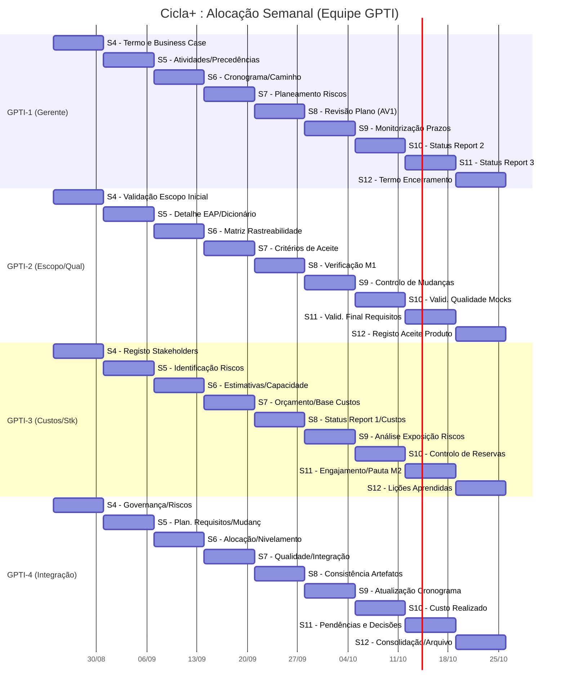

# Plano de Projeto — Cicla+ (Plataforma de Conexão para Ciclistas)

**Versão:** 1.1 (Revisão de capacidade: 7 membros)  
**Data:** 04/10/2026  
**Patrocinador:** Prof. Diogo Mendonça  
**Equipe:** 3 alunos de PSW (produto e desenvolvimento) e 4 alunos de GPTI (gestão e validação do escopo)

> Este documento contém a declaração do escopo, os requisitos, a matriz de rastreabilidade, a EAP, o cronograma, os recursos, os custos, os riscos e o engajamento. Os identificadores PSW-1 a PSW-3 e GPTI-1 a GPTI-4 serão substituídos pelos nomes dos alunos quando a equipe for confirmada. GPTI-1 é o gerente do projeto.

**Números da linha de base**

| O quê | Valor | Onde |
|---|---:|---|
| Capacidade dos calendários | 162 h PSW + 144 h GPTI = 306 h | 5.3 |
| Atividades niveladas | 162 h PSW + 144 h GPTI = 306 h, R$ 5.766,92 | 5.2, 6.2 |
| Contingência, por evento nomeado | 25 h (15 h PSW + 10 h GPTI), R$ 471,15 | 6.3.3 |
| Linha de base de custos | 331 h, R$ 6.238,07 | 6.4 |
| Reserva gerencial, fora da linha de base | 7%, R$ 436,66 | 6.4 |
| Orçamento total simulado | R$ 6.674,73; desembolso R$ 0 | 6.4 |
| Marcos | M1/AV1 na S8; M2/Encerramento na S12 | 5.1 |

## 1. Objetivo da EAP

Decompor o trabalho e as entregas do protótipo do Cicla+ em componentes gerenciáveis, cobrindo os casos de uso de relacionamento, treinos e gamificação. A EAP é orientada a entregas; a numeração representa a relação hierárquica. O produto desta fase é um protótipo acadêmico para avaliação.

## 2. EAP / WBS

### 1.0 Projeto da Plataforma Cicla+

- **1.1 Gestão e coordenação do projeto (GPTI)**
  - 1.1.1 Termo de abertura, business case e plano de trabalho mantidos
  - 1.1.2 Backlog, decisões, riscos e mudanças acompanhados
  - 1.1.3 Aceites internos e controle de qualidade realizados
- **1.2 Fase 1: Core Business (Prioridade 1)**
  - 1.2.1 Operações Base (CRUD): Manter Ciclista, Equipe e Confronto (A1)
  - 1.2.2 Relacionamento e Comunicação: Dar Match e Usar Chat (A2)
  - 1.2.3 Organização de Atividades: Marcar Treino em Equipe e Confrontos (A3)
  - 1.2.4 Fechamento: Registrar Resultado e Confirmar Encerramento (A4)
- **1.3 Fase 2: Suporte ao Fluxo Principal (Prioridade 2)**
  - 1.3.1 Cronometragem: Marcar Treino Individual e Manter Tempo (A5)
  - 1.3.2 Gamificação Básica: Emitir Ranking e Conferir Ranking (A6)
- **1.4 Fase 3: Funcionalidades Adicionais (Prioridade 3)**
  - 1.4.1 Sistema de Monetização: Usar Boost (A7)
  - 1.4.2 Socialização: Manter Passeio e Marcar Consultoria (A8)

## 3. Regras de negócio do protótipo

1. **Lógica de Match e Comunicação:** O sistema só desbloqueia e permite o envio de mensagens no chat se ambos os ciclistas tiverem dado "match" um no outro na tela de sugestões.
2. **Confirmação de Confrontos:** Um confronto criado por um usuário permanece com status "Pendente" e só transita para "Confirmado" após o aceite explícito do desafiado.
3. **Atualização de Rankings:** A pontuação no ranking oficial não é editada manualmente; ela é derivada e atualizada de forma automática assim que as partes confirmam o encerramento de um resultado.
4. **Boost (Monetização):** O acionamento do "Boost" altera a ordem de prioridade no banco de dados, colocando o perfil do usuário no topo da fila de sugestões de outros ciclistas.

## 4. Linha de base do escopo

### 4.1 Declaração do escopo

Entregar, em 12 semanas, um protótipo da plataforma Cicla+ com fluxos de cadastro, match, chat, agendamento de confrontos, cronometragem simulada em tela e emissão de ranking. Estão fora do escopo: e-commerce de produtos de ciclismo, integração real com GPS (mockado em tela) e gateway de pagamentos real para o Boost.

### 4.2 Necessidade e solução

| ID | Necessidade | Origem | Solução adotada neste protótipo |
|---|---|---|---|
| REQ-01 | Encontrar ciclistas compatíveis para atividades. | Business Case | Sistema de sugestão de perfis com função "Dar Match". |
| REQ-02 | Comunicar-se de forma segura. | Matriz Perfil/Funcionalidade | Chat interno liberado apenas após o "Match" mútuo. |
| REQ-03 | Organizar disputas e registrar quem venceu. | Matriz CRUD | Fluxo de "Marcar Confronto" com confirmação dupla. |
| REQ-04 | Acompanhar o tempo das atividades. | Business Case | Cronômetro nativo em tela operando durante o treino. |
| REQ-05 | Ver a classificação oficial na plataforma. | Matriz CRUD | Ranking gerado automaticamente com base nos resultados. |
| REQ-06 | Destacar o próprio perfil para mais visibilidade. | Business Case | Função "Usar Boost" que altera a ordenação do perfil. |
| REQ-07 | Consultar atividades como "Equipe". | Matriz Perfil/Funcionalidade | Alternância de interface (Ciclista/Equipe). |

### 4.3 Matriz de rastreabilidade

| ID | Pacotes | Aceite observável |
|---|---|---|
| REQ-01 | 1.2.1, 1.2.2 (A1, A2) | A tela exibe um perfil; ao aceitar, se recíproco, acusa match. |
| REQ-02 | 1.2.2 (A2) | A caixa de mensagens fica bloqueada até o match ser verdadeiro. |
| REQ-03 | 1.2.3, 1.2.4 (A3, A4) | Confronto só muda para "Confirmado" se a outra parte aceitar. |
| REQ-04 | 1.3.1 (A5) | O cronômetro inicia e salva o tempo exato no histórico ao parar. |
| REQ-05 | 1.2.4, 1.3.2 (A4, A6) | Após confirmação do resultado, a posição no ranking é recalculada. |
| REQ-06 | 1.4.1 (A7) | O perfil com Boost ativado aparece no topo da fila de matches. |
| REQ-07 | 1.2.3, 1.4.2 (A3, A8) | O sistema exibe menus diferentes para usuário Ciclista ou Equipe. |

## 5. Processo de elaboração do cronograma

### 5.1 Planejar o gerenciamento do cronograma

- **Horizonte:** 12 semanas letivas. M1/AV1 na semana 8. M2 na semana 12.
- **Calendários:** A equipe PSW trabalha nas semanas 1–12 (4,5 h/semana por aluno). A equipe GPTI estuda conceitos nas semanas 1–3 e trabalha no projeto nas semanas 4–12 (4 h/semana por aluno).

### 5.2 Definir e sequenciar as atividades (Rede Técnica)

| ID | Atividade (Pacote) | Predecessora | Duração (Dias) | Esforço Total | Custo Simulado |
|---|---|---|---:|---:|---:|
| A1 | Operações Base (CRUD) | — | 5 | 24,0 h | R$ 452,30 |
| A2 | Funcionalidade Match e Chat | A1 (FS) | 6 | 27,0 h | R$ 508,84 |
| A3 | Marcar Treinos e Confrontos | A2 (FS) | 8 | 36,0 h | R$ 678,46 |
| A4 | Fechar Atividades e Resultados | A3 (FS) | 5 | 22,5 h | R$ 424,04 |
| A5 | Cronometrar Desempenho | A3 (FS) | 7 | 27,0 h | R$ 508,84 |
| A6 | Emitir Ranking Oficial | A4 (FS) | 4 | 12,0 h | R$ 226,15 |
| A7 | Sistema de Monetização (Boost) | A2 (FS) | 3 | 9,0 h | R$ 169,62 |
| A8 | Passeios e Consultoria | A1 (FS) | 5 | 4,5 h | R$ 84,81 |
| **Total** | **Desenvolvimento Técnico (PSW)** | | | **162,0 h** | **R$ 3.053,07** |

### 5.3 Estimar recursos e durações

| Grupo | Pessoas | Calendário disponível | Planejado nas atividades | Utilização |
|---|---:|---|---:|---:|
| PSW | 3 | 4,5 h/semana, S1–S12 (162 h) | 162 h | 100% |
| GPTI | 4 | 4 h/semana, S4–S12 (144 h) | 144 h | 100% |
| **Total** | **7** | **306 h** | **306 h** | **100%** |

### 5.4 Caminho Crítico

- **Rotas:**
  - Rota 1: A1 → A2 → A3 → A4 → A6 = 28 dias úteis (Caminho Crítico).
  - Rota 2: A1 → A2 → A3 → A5 = 26 dias úteis (Folga: 2 dias).
  - Rota 3: A1 → A2 → A7 = 14 dias úteis (Folga: 14 dias).
  - Rota 4: A1 → A8 = 10 dias úteis (Folga: 18 dias).

```mermaid
  gantt
    title Cicla+ : Rede de Atividades Técnicas (Caminho Crítico)
    dateFormat  YYYY-MM-DD
    axisFormat  %d/%m
    
    section Fase 1 (Core)
    A1. Operações Base (CRUD)        :a1, 2026-08-03, 5d
    A2. Match e Chat                 :a2, after a1, 6d
    A3. Marcar Treinos e Confrontos  :a3, after a2, 8d
    A4. Fechar Atividades/Resultados :a4, after a3, 5d
    
    section Fase 2 (Suporte)
    A5. Cronometrar Desempenho       :a5, after a3, 7d
    A6. Emitir Ranking Oficial       :a6, after a4, 4d
    
    section Fase 3 (Adicionais)
    A7. Sistema de Boost             :a7, after a2, 3d
    A8. Passeios e Consultoria       :a8, after a1, 5d
  ```

### 5.5 Alocação semanal individual — PSW

| Semana | PSW-1 (Frontend / Ecrãs) | PSW-2 (Backend / Banco) | PSW-3 (Regras e Integração) |
|---:|---|---|---|
| **S1** | Ecrãs de Base e CRUD — 4,5 h | Modelação BD e CRUD — 4,5 h | Lógica de Perfis — 4,5 h |
| **S2** | Protótipos Match/Chat — 4,5 h | API de Match — 4,5 h | Regras do "Dar Match" — 4,5 h |
| **S3** | Ecrãs Treinos/Confrontos — 4,5 h | API de Confrontos — 4,5 h | Fluxo de Aceite — 4,5 h |
| **S4** | Formulários de Resultados — 4,5 h | API de Resultados — 4,5 h | Validação de Ganhadores — 4,5 h |
| **S5** | Componentes Partilhados — 4,5 h | Mocks Iniciais — 4,5 h | Testes Unitários Base — 4,5 h |
| **S6** | Ecrãs do Cronômetro — 4,5 h | API do Cronômetro — 4,5 h | Lógica de 2º Plano — 4,5 h |
| **S7** | Ecrãs de Ranking/Boost — 4,5 h | API de Ranking/Boost — 4,5 h | Cálculo de Posição — 4,5 h |
| **S8 (M1)**| Testes e Correções M1 — 4,5 h | Testes e Correções M1 — 4,5 h | Demonstração M1 — 4,5 h |
| **S9** | Integração React — 4,5 h | Integração Express/Mongo — 4,5 h | Testes de Integração — 4,5 h |
| **S10** | Ecrãs Consultoria (A8) — 4,5 h | API Consultoria (A8) — 4,5 h | Lógica de Interfaces — 4,5 h |
| **S11** | Ajustes Visuais Finais — 4,5 h | Ajustes de Performance — 4,5 h | Validação de Qualidade — 4,5 h |
| **S12 (M2)**| Testes e Documentação — 4,5 h | Testes e Documentação — 4,5 h | Demonstração M2 — 4,5 h |
| **Total** | **54 horas** | **54 horas** | **54 horas** |

```mermaid
gantt
    title Cicla+ : Alocação Semanal (Equipe PSW)
    dateFormat  YYYY-MM-DD
    axisFormat  %d/%m
    
    section PSW-1 (Frontend)
    S1 - Ecrãs Base e CRUD       :2026-08-03, 7d
    S2 - Protótipos Match/Chat   :2026-08-10, 7d
    S3 - Ecrãs Treinos/Confrontos:2026-08-17, 7d
    S4 - Forms de Resultados     :2026-08-24, 7d
    S5 - Comp. Partilhados       :2026-08-31, 7d
    S6 - Ecrãs do Cronômetro     :2026-09-07, 7d
    S7 - Ecrãs de Ranking/Boost  :2026-09-14, 7d
    S8 - Testes e Correções M1   :2026-09-21, 7d
    S9 - Integração React        :2026-09-28, 7d
    S10 - Ecrãs Consultoria (A8) :2026-10-05, 7d
    S11 - Ajustes Visuais Finais :2026-10-12, 7d
    S12 - Testes e Documentação  :2026-10-19, 7d
    
    section PSW-2 (Backend)
    S1 - Modelação BD e CRUD     :2026-08-03, 7d
    S2 - API de Match            :2026-08-10, 7d
    S3 - API de Confrontos       :2026-08-17, 7d
    S4 - API de Resultados       :2026-08-24, 7d
    S5 - Mocks Iniciais          :2026-08-31, 7d
    S6 - API do Cronômetro       :2026-09-07, 7d
    S7 - API de Ranking/Boost    :2026-09-14, 7d
    S8 - Testes e Correções M1   :2026-09-21, 7d
    S9 - Integr. Express/Mongo   :2026-09-28, 7d
    S10 - API Consultoria (A8)   :2026-10-05, 7d
    S11 - Ajustes Performance    :2026-10-12, 7d
    S12 - Testes e Documentação  :2026-10-19, 7d
    
    section PSW-3 (Regras)
    S1 - Lógica de Perfis        :2026-08-03, 7d
    S2 - Regras do Match         :2026-08-10, 7d
    S3 - Fluxo de Aceite         :2026-08-17, 7d
    S4 - Validação Ganhadores    :2026-08-24, 7d
    S5 - Testes Unitários Base   :2026-08-31, 7d
    S6 - Lógica de 2º Plano      :2026-09-07, 7d
    S7 - Cálculo de Posição      :2026-09-14, 7d
    S8 - Demonstração M1         :2026-09-21, 7d
    S9 - Testes de Integração    :2026-09-28, 7d
    S10 - Lógica de Interfaces   :2026-10-05, 7d
    S11 - Validação de Qualidade :2026-10-12, 7d
    S12 - Demonstração M2        :2026-10-19, 7d
```

### 5.6 Alocação semanal individual — GPTI

| Semana | GPTI-1 | GPTI-2 | GPTI-3 | GPTI-4 |
|---:|---|---|---|---|
| **S1–S3** | *Aulas de Conceitos* — 0 h | *Aulas de Conceitos* — 0 h | *Aulas de Conceitos* — 0 h | *Aulas de Conceitos* — 0 h |
| **S4** | Termo e Business Case — 4 h | Validação Escopo inicial — 4 h | Registo Stakeholders — 4 h | Governança/Riscos — 4 h |
| **S5** | Atividades e Precedências — 4 h | Detalhe EAP/Dicionário — 4 h | Identificação de Riscos — 4 h | Plan. Requisitos/Mudanças — 4 h |
| **S6** | Cronograma/Caminho — 4 h | Matriz Rastreabilidade — 4 h | Estimativas/Capacidade — 4 h | Alocação/Nivelamento — 4 h |
| **S7** | Planeamento Riscos — 4 h | Critérios de Aceite — 4 h | Orçamento/Base Custos — 4 h | Qualidade/Integração — 4 h |
| **S8 (M1)**| Revisão Plano (AV1) — 4 h | Verificação M1 — 4 h | Status Report 1/Custos — 4 h | Consistência Artefatos — 4 h |
| **S9** | Monitorização Prazos — 4 h | Controlo de Mudanças — 4 h | Análise Exposição Riscos — 4 h | Atualização Cronograma — 4 h |
| **S10** | Status Report 2 — 4 h | Validação Qual. Mocks — 4 h | Controlo de Reservas — 4 h | Custo Realizado — 4 h |
| **S11** | Status Report 3 — 4 h | Validação Final Requisitos — 4 h | Engajamento/Pauta M2 — 4 h | Pendências e Decisões — 4 h |
| **S12 (M2)**| Termo Encerramento — 4 h | Registo Aceite Produto — 4 h | Lições Aprendidas — 4 h | Consolidação/Arquivo — 4 h |
| **Total** | **36 horas** | **36 horas** | **36 horas** | **36 horas** |



### 5.7 Matriz de responsabilidades e fazer ou comprar

Há um responsável por prestar contas (A - *Accountable*) em cada pacote principal da EAP. Os demais membros técnicos executam (R - *Responsible*). O patrocinador não recebe "A" de pacote técnico, pois seu papel é aprovar marcos, mudanças e encerramentos. GPTI-1 é o gerente do projeto e presta contas do plano inteiro; GPTI-4 prepara a comunicação.

| Pacote / Fase | Presta contas (A) | Executa (R) |
|---|---|---|
| 1.1 Gestão e coordenação | GPTI-1 | GPTI-1 a GPTI-4 |
| 1.2 Fase 1: Core Business | PSW-1 | PSW-1 a PSW-3 |
| 1.3 Fase 2: Suporte ao Fluxo Principal | PSW-2 | PSW-1 a PSW-3 |
| 1.4 Fase 3: Funcionalidades Adicionais | PSW-3 | PSW-1 a PSW-3 |

**Fazer ou comprar:** O protótipo do Cicla+ será totalmente **feito** pela equipe. O objetivo da disciplina é a aprendizagem no desenvolvimento do produto (PSW) e na gestão do projeto (GPTI). Comprar uma solução white-label de aplicativo de relacionamentos esportivos ou contratar integrações prontas anularia o propósito acadêmico e ultrapassaria o orçamento de desembolso previsto, que é de R$ 0,00.

## 6. Orçamento por composição

### 6.1 Premissas

- Custo econômico simulado utilizando a taxa-sombra de R$ 18,8461538/hora. Desembolso real é R$ 0,00.
- A linha de base contempla as 306 h do esforço nominal (162 h PSW + 144 h GPTI).

### 6.2 Distribuição semanal da linha de base das atividades

Abaixo, a evolução do esforço e do custo econômico simulado semana a semana. A equipe PSW trabalha 13,5 h semanais (3 alunos × 4,5 h). A equipe GPTI entra no projeto a partir da semana 4, agregando 16 h semanais (4 alunos × 4 h). 

| Semana | PSW | GPTI | Total | Custo simulado (R$) | Saída principal esperada |
|---:|---:|---:|---:|---:|---|
| **1** | 13,5 h | 0 h | 13,5 h | R$ 254,42 | Requisitos, Base CRUD e Lógica de Perfis |
| **2** | 13,5 h | 0 h | 13,5 h | R$ 254,42 | Protótipos e API de Match/Chat |
| **3** | 13,5 h | 0 h | 13,5 h | R$ 254,42 | Ecrãs Treino, API Confrontos, Fluxo Aceite |
| **4** | 13,5 h | 16 h | 29,5 h | R$ 555,96 | Resultados; Termo, Escopo e Riscos Iniciais |
| **5** | 13,5 h | 16 h | 29,5 h | R$ 555,96 | Mocks; EAP, Dicionário e Precedências |
| **6** | 13,5 h | 16 h | 29,5 h | R$ 555,96 | Cronômetro; Cronograma e Caminho Crítico |
| **7** | 13,5 h | 16 h | 29,5 h | R$ 555,96 | Ranking/Boost; Orçamento e Planeamento Riscos |
| **8 (M1)** | 13,5 h | 16 h | 29,5 h | R$ 555,96 | Testes M1; Revisão Plano (AV1) |
| **9** | 13,5 h | 16 h | 29,5 h | R$ 555,96 | Integração Técnica; Monitorização Prazos |
| **10** | 13,5 h | 16 h | 29,5 h | R$ 555,96 | APIs Consultoria; Status Report 2 e Custos |
| **11** | 13,5 h | 16 h | 29,5 h | R$ 555,96 | Ajustes Finais; Status Report 3 e Engajamento |
| **12 (M2)**| 13,5 h | 16 h | 29,5 h | R$ 555,96 | Demonstração Final; Termo de Encerramento |
| **Total** | **162,0 h**| **144,0 h**| **306,0 h**| **R$ 5.766,92** | |

### 6.3 Análise qualitativa e reserva de contingência

| ID | Risco e impacto | Prob. | Impacto | Prioridade | Gatilho (Quando acionar contingência) | Exposição |
|---|---|---:|---:|---|---|---:|
| RT01 | Telas duplas (Ciclista/Equipe) atrasam o pacote A3. | 40% | 20 h | **Alta** | Passar de 50% do prazo sem as duas interfaces aprovadas. | 8,0 h |
| RT02 | Falta de operações CRUD trava testes de integração. | 30% | 15 h | **Média** | Erro de endpoint no 1º teste de integração. | 4,5 h |
| RT03 | Cronômetro conflita com restrição de bateria do SO. | 30% | 20 h | **Média** | SO "mata" o cronômetro no teste da S6. | 6,0 h |
| RT04 | Cálculo automático do ranking gera lentidão. | 20% | 15 h | **Baixa** | Ranking demora >3 seg para carregar na S9. | 3,0 h |
| RG01 | Algoritmo "Boost" falha na ordenação do perfil. | 25% | 12 h | **Baixa** | Ativar o Boost não altera o topo da fila JSON. | 3,0 h |

**Exposição Total:** 24,5 h. Arredondamos a Reserva de Contingência para **25 h** (15 h PSW + 10 h GPTI).

### 6.4 Linha de base de custos e orçamento

| Componente | Cálculo | Valor simulado |
|---|---|---:|
| Atividades PSW | 162 h × R$ 18,8461538/h | R$ 3.053,07 |
| Atividades GPTI | 144 h × R$ 18,8461538/h | R$ 2.713,85 |
| **Custo das atividades** | 306 h | **R$ 5.766,92** |
| Reserva de contingência | 25 h × R$ 18,8461538/h | R$ 471,15 |
| **Linha de base de custos** | 331 h (Atividades + Contingência) | **R$ 6.238,07** |
| Reserva gerencial | 7% × R$ 6.238,07 | R$ 436,66 |
| **Orçamento total simulado** | Linha de base + Reserva gerencial | **R$ 6.674,73** |

## 7. Plano de engajamento das partes interessadas e comunicações

### 7.1 Matriz de engajamento e estratégia

O engajamento define quem impacta o projeto e qual a abordagem. Instituições reais (equipes esportivas oficiais, sistemas de GPS) mantêm-se como neutras nesta etapa, uma vez que se trata de um protótipo acadêmico sem integração externa autorizada.

| Parte | Poder | Interesse | Impacto | Estratégia |
|---|---|---|---|---|
| **Patrocinador (Prof. Diogo)** | Alto (Aprova notas, mudanças e marcos) | Alto | Alto | Gerenciar de perto |
| **Equipes GPTI e PSW** | Médio (Controlam execução e código) | Alto | Alto | Gerenciar de perto |
| **Ciclistas (Usuários alvo)** | Baixo (Não aprovam o protótipo formalmente) | Alto | Alto | Manter informado |
| **Equipes de Ciclismo** | Baixo nesta fase | Médio | Alto | Manter satisfeito |

### 7.2 Cadência de comunicações

A comunicação estabelece o canal, o conteúdo e o ritmo exato para manter os stakeholders alinhados sem gerar ruído.

| Público | Objetivo / Conteúdo | Canal | Ritmo | Responsável |
|---|---|---|---|---|
| **Patrocinador** | Aprovar entregas, rever escopo e riscos; Síntese de marcos. | Demonstrações (M1 e M2) e registro escrito. | Quinzenal; e fim das semanas 8 e 12. | GPTI-4 |
| **Equipe GPTI** | Sincronizar plano, controlar prazos e consolidar artefatos. | Quadro visual do projeto e reunião de gestão. | Semanal | GPTI-1 |
| **Equipe PSW** | Alinhamento técnico, revisão de código e relato de impedimentos. | Repositório (Commits/PRs) e reunião com GPTI. | Semanal | PSW-1 |
| **Ciclistas / Equipes** | Coleta de percepções sobre o fluxo. É crucial informar que se trata de protótipo sem uso oficial. | Demonstração pontual com dados mockados. | Pontual (no M1 ou M2). | GPTI-3 e PSW-3 |

## 8. Controlar o cronograma, os recursos e os custos

- O apontamento de horas será realizado semanalmente. GPTI-1 consolida o esforço realizado vs. planejado.
- Entregas só recebem crédito integral se passarem pelo critério de aceite documentado na matriz de rastreabilidade.
- Variação superior a 10% do esforço da atividade requer análise e acionamento de gatilho/contingência, caso aplicável.
- Modificações de escopo que ultrapassem a contingência devem ser escaladas ao Patrocinador.